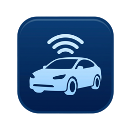

  

# Volkswagen Connect — Home Assistant integration

A **read-only** Home Assistant integration that pulls your Volkswagen vehicle
data from two attestation-free channels: your **volkswagen.de** account
(battery/charging, odometer, service/inspection due, vehicle-health warning
lights, lock history, vehicle image) and the **EU Data Act portal** (a rich set
of additional telemetry once you enable a continuous data request).

> Install via **HACS → ⋮ → Custom repositories →**
> `https://github.com/rafaelhutter/ha-volkswagen-connect` (category *Integration*),
> then add the **Volkswagen Connect** integration.

> Both sources are read-only and attestation-free. The volkswagen.de session is
> the reliable "always there" source; the EU Data Act portal adds a lot more
> detail once configured — see
> [EU Data Act — rich vehicle telemetry](#eu-data-act--rich-vehicle-telemetry).
> Where the two overlap (e.g. battery, odometer) the cleaner volkswagen.de
> sensor is kept and the duplicate is dropped automatically.

## Why this exists

In May–June 2026 Volkswagen retired the WeConnect app OAuth client and put the
CARIAD BFF token exchange behind **app attestation** (Play Integrity / "client
assertion"), which open-source clients cannot satisfy — breaking
`volkswagencarnet`, `evcc`, `openWB`, and others. The **volkswagen.de** website
logs in through a server-side confidential client (`authproxy`) that does **not**
require attestation, so its data is reachable once you authenticate. This
integration reuses that website session.

## Prerequisites (one-time, in a browser)

The data comes from your **volkswagen.de** account, which must be **activated**
for the vehicle once:

1. Go to **https://www.volkswagen.de** → log in with your Volkswagen ID →
   **myVolkswagen**, and open your vehicle.
2. Under *Ihre mobilen Online-Dienste* complete **„Identität bestätigen"**
   (confirm identity) so you become the **Hauptnutzer / primary user**. The
   portal walks you through the *Vehicle Activation Service* and finishes with
   *„Super! Sie sind jetzt startklar."* (all steps **Fertig**).
   - Normal account step — **no S-PIN or in-car confirmation** needed; it reuses
     your existing login. If you already use the VW app or portal, it's usually
     done already.

During integration setup you log in with the same Volkswagen ID and approve an
**email OTP**; the integration then reuses that website session.

## Install

**HACS (recommended)**
1. HACS → ⋮ (top right) → **Custom repositories**.
2. Repository: `https://github.com/rafaelhutter/ha-volkswagen-connect`, category **Integration** → Add.
3. Install **Volkswagen Connect**, then restart Home Assistant.
4. Settings → Devices & Services → **Add Integration** → "Volkswagen Connect".
5. Enter your Volkswagen ID email/password, select your brand, and approve the
   **email OTP** when prompted.

**Manual**
Copy `custom_components/volkswagen_connect/` into your HA `config/custom_components/`,
restart, then add the integration.

## Entities

One device per vehicle:
- **Live battery / charging** (volkswagen.de portal): Battery (SoC %), Electric range,
  Charging state, Charge power/rate, Charge time remaining, Target battery, Battery
  temperature, Plug / Plug lock / External power.
- **Odometer**, **Inspection due**, **Oil service due**, **Last vehicle report**.
- **Warning lights** — number of active dashboard warning lights (`0` = all OK).
- **Last lock command** / **Last lock command time** — most recent *confirmed*
  remote lock/unlock from the transaction log (command history, **not** a live
  lock sensor — see Limitations).
- **Lock** / **Open** — vehicle-level lock and opening status from the EU Data Act
  feed, as binary sensors (Locked/Unlocked, Open/Closed). These are summary flags,
  **not** per-door (VW delivers only the aggregate). Upgrading from a build with the
  old `Locked`/`Open` *text* sensors replaces them with these binary sensors and
  **purges the old sensors' recorder history** (so they don't linger as
  `unavailable` for ~10 days). Their live values are unaffected.
- **Images** — the vehicle's exterior photos. The side view is the default
  **Image** entity; the other angles (front/rear, left/centre/right) are added
  disabled-by-default, enable the ones you want per device.
- **Data status** — `ok` / `no_data` / `not_configured`. Reflects the EU Data Act
  source (below): `not_configured` until you enable a continuous data request,
  `ok` once data is delivered. It does **not** affect the volkswagen.de data above.
- **EU Data Act telemetry** (once configured) — a large set of additional
  sensors mapped one-per-signal from the delivered dataset: HV battery details,
  charge timers and settings, climate setpoints, outdoor temperature, slope/
  residual consumption, parking/light/lock states, and more. Values are made
  human-readable (e.g. `CHARGE_STATE_NOT_READY_FOR_CHARGING` → *Not ready for
  charging*), with the original VW code kept on each sensor's `raw_value`
  attribute for templates/automations.

## Limitations

- **Read-only.** No remote control (lock/climate/charge) — that needs the
  attestation-gated app API and is not possible.
- **No live _per-door_ / per-window / climate / parking-position status.** The
  volkswagen.de portal gates these behind VW's *secured-operations* tier that only
  the attestation-backed mobile app can read (the endpoints return `401` even for a
  fully-activated primary user). The EU Data Act feed does provide a vehicle-level
  **Lock** / **Open** summary (the binary sensors above), but not per-door detail.
  The *Last lock command* sensor surfaces the lock/unlock **history** from the portal.

## EU Data Act — rich vehicle telemetry

The EU Data Act obliges carmakers to expose vehicle data through a standardized
portal (`eu-data-act.drivesomethinggreater.com`). Once you enable a **continuous
data request** there, the integration receives the delivered dataset every ~15
minutes and turns it into sensors — one per signal, tracking the latest value.

This is a **rich** source: HV battery state, charge power/rate/energy and timers,
charge-mode settings, climate setpoints, outdoor temperature, slope and residual
consumption, parking/light/door-lock states, and more. Cryptic VW enum codes are
shown human-readable (the raw code stays on each sensor's `raw_value` attribute),
and fields that duplicate a volkswagen.de sensor are dropped automatically.

**One-time setup (in a browser):**

1. Go to **https://eu-data-act.drivesomethinggreater.com**, log in with your
   Volkswagen ID, accept the consent screen, and link your vehicle.
2. Enable a **continuous data request**: *Data clusters → Vehicle overview →
   Get customised data → **All data**, frequency **15 minutes***.

Until you do this, the **Data status** sensor reads `not_configured` and only the
volkswagen.de sensors appear. Delivery depends on the car reporting in, so values
update roughly every 15 minutes (not real-time).

## Supported brands

The **volkswagen.de** source is **Volkswagen** only. The brand selector feeds the
EU Data Act client, which also targets Audi, Škoda, SEAT, CUPRA and Bentley via
their portal OAuth clients (developed and tested against Volkswagen; other brands
should work but are unverified).

## Credits

Stands on the shoulders of robinostlund's
[`volkswagencarnet`](https://github.com/robinostlund/volkswagencarnet), which did
the heavy lifting over many years as *the* Home Assistant VW integration. When
VW's 2026 app-attestation lock broke the underlying API, this project picks up
where it left off — extending and fixing access through the remaining
attestation-free channels.

Auth/data flow reverse-engineered with reference to TA2k's
[`ioBroker.vw-connect`](https://github.com/TA2k/ioBroker.vw-connect)
(`lib/euDataAct.js`).

## License

MIT — see [LICENSE](LICENSE).
